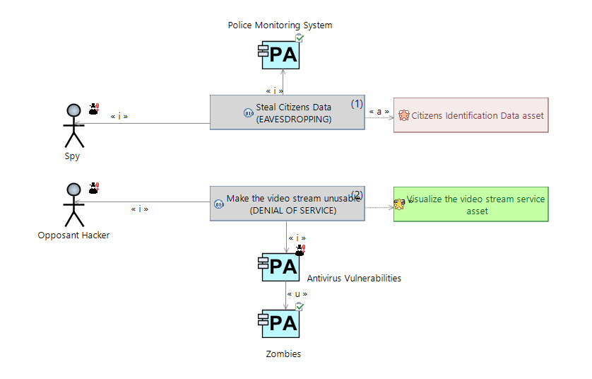

## Compatibility

This add-on is compatible with Capella and Team for Capella (i.e. remote models), official support and integration to Orchestra from V1.0.0 (i.e. Capella 5.1 and Orchestra Gold 5.9.2).

## Darc Viewpoint (Cybersecurity Assets & Threats Modeling analysis) Guide

Capella Darc add-on is to support effective co-engineering between systems and cybersecurity engineers teams when performing the following tasks:

* Identify assets & trust boundaries
* Identify threats
* Characterize security needs

	
	
*Note: Official documentation is embedded in the addon. Please install it into Capella to have a documentation working properly. Some links or images in the online documentation below may be broken*

[Installation And Uninstallation](https://gitlab.thalesdigital.io/capella-addons/cybersecurity/-/blob/master/plugins/org.polarsys.capella.cybersecurity.doc/html/InstallationUninstallation/Installation%20and%20Uninstallation.mediawiki)

[User Manual](https://gitlab.thalesdigital.io/capella-addons/cybersecurity/-/blob/master/plugins/org.polarsys.capella.cybersecurity.doc/html/usermanual.mediawiki)